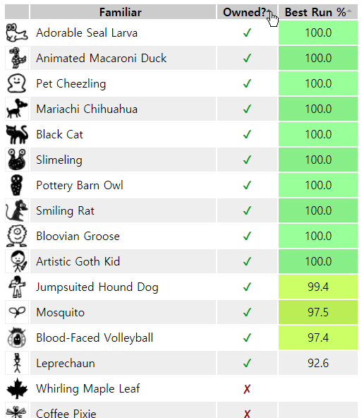

# 100familiars

100familiars is a custom relay script for KoLmafia. It displays a table of familiars you currently own, as well as the highest familiar % record for each familiar from your ascensions.

This script is a spiritual successor of matt.chugg's [Familiar Collector/Ascension Familiar Chooser](https://kolmafia.us/threads/familiar-collector-ascension-familiar-chooser.7433/).

## Installing

Enter the following into KoLmafia's gCLI:

```
svn checkout https://github.com/pastelmind/100familiars/trunk/release
```

## Features

- Highlight familiars with 100% runs, or those with 90%-100% runs
- Table sorting

## Screenshots


