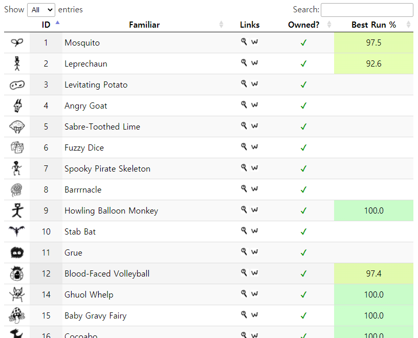

# 100familiars

[](https://github.com/pastelmind/100familiars/actions)

100familiars is a custom relay script for KoLmafia. It displays a table of familiars you currently own, as well as the highest familiar % record for each familiar from your ascensions.

This script is a spiritual successor of matt.chugg's [Familiar Collector/Ascension Familiar Chooser](https://kolmafia.us/threads/familiar-collector-ascension-familiar-chooser.7433/).

_This script requires KoLmafia r20550 or later._

## Installing

Enter the following into KoLmafia's gCLI:

```
svn checkout https://github.com/pastelmind/100familiars/branches/release
```

## Features

- Highlight familiars with 100% runs, or those with 90%-100% runs
- Table sorting
- Works even if your challenge path prevents access to familiars

## Screenshots



## Development

To create a new release, run:

```
npm run release [commit message]
```

This compiles and bundles the relay script, copies minified dependencies, and commits them to the `release` branch. You can optionally provide a custom commit message.

To use another release branch (for testing), use:

```
npm run release -- --branch <branch_name> [commit message]
```

To build without committing to a release branch:

```
npm run release -- --no-
```
